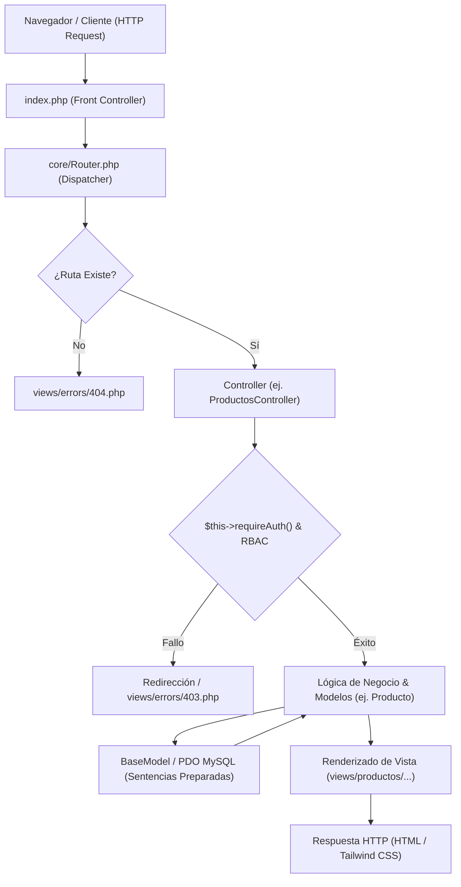

# 🏗️ Arquitectura del Sistema y Mapa de Archivos — mi_bodega

Este documento proporciona una visión exhaustiva de la arquitectura **MVC (Modelo-Vista-Controlador)** en **PHP 8** del proyecto **mi_bodega**, explicando el ciclo de vida completo de cada petición HTTP y detallando el propósito de **todos y cada uno de los archivos** del código fuente.

---

## 🔄 1. Ciclo de Vida de una Petición (Request Lifecycle)

Cada interacción del usuario con la aplicación sigue un flujo estricto y predecible a través de los componentes del patrón MVC:



### Paso a Paso del Flujo:
1. **Entrada Única (`index.php`)**:
   - Inicializa el entorno configurando la zona horaria (`America/Caracas`) e inicia la sesión nativa (`session_start()`).
   - Carga la configuración global (`config/app.php`), credenciales locales (`config/config_local.php`) y helpers (`includes/helpers.php`).
   - Registra el **Autoloader** dinámico de PHP (`spl_autoload_register`) que localiza automáticamente clases en `core/`, `controllers/` y `models/`.
2. **Despacho de Rutas (`core/Router.php`)**:
   - Analiza la `REQUEST_URI` entrante para resolver **Rutas Limpias** (ej. `/pos`, `/productos`, `/usuarios`). La ruta predeterminada de entrada al autenticarse o acceder a la raíz es el Punto de Venta (`/pos`).
   - Si no coincide con ninguna ruta limpia, analiza los parámetros heredados `$_GET['controller']` y `$_GET['action']`.
   - Verifica la existencia del archivo del controlador y del método. Si la ruta no existe, renderiza `views/errors/404.php`.
3. **Middleware de Seguridad (`BaseController`)**:
   - Al instanciarse el controlador destino, su constructor invoca `$this->requireAuth()` para asegurar que exista una sesión activa (`$_SESSION['usuario']`).
   - Para módulos restringidos (como `UsuariosController`), ejecuta `$this->requireRole('admin')`. Si se violan los permisos, detiene la petición con estado HTTP 403.
4. **Capa de Modelo y Base de Datos (`models/` + `core/BaseModel.php`)**:
   - El controlador llama a los métodos del modelo. Toda interacción con MySQL pasa por `BaseModel` mediante la conexión Singleton PDO (`config/database.php`).
   - Las consultas utilizan sentencias preparadas (`prepare` / `execute`) garantizando **100% de inmunidad a inyecciones SQL**.
   - Para operaciones complejas (ej. ventas y surtidos), se aplican **Transacciones Atómicas** (`beginTransaction`, `commit`, `rollBack`).
5. **Generación de la Respuesta (Vistas)**:
   - El controlador envía las variables procesadas a las plantillas en `views/`.
   - La vista utiliza helpers sanitizadores como `sanitize()` (`htmlspecialchars`), `url()` y `assets()` para generar salidas HTML e incluir recursos estáticos.

---

## 🗂️ 2. Mapa Exhaustivo de Archivos del Proyecto

A continuación se detalla la función exacta de cada archivo en la estructura de directorios:

```text
mi_bodega/
├── config/                     # Configuración del Sistema
│   ├── app.php                 # Constantes de URL (BASE_URL), zona horaria y defaults
│   ├── config_local.php        # Credenciales de base de datos MySQL (host, user, pass, db)
│   └── database.php            # Singleton de conexión PDO con MySQL
│
├── core/                       # Núcleo del Framework MVC
│   ├── BaseController.php      # Clase base: autenticación, RBAC, redirecciones y helpers
│   ├── BaseModel.php           # Capa de datos base: consultas PDO, paginación y transacciones
│   └── Router.php              # Enrutador semántico y despachador de peticiones HTTP
│
├── controllers/                # Controladores (Lógica de Negocio)
│   ├── LoginController.php     # Autenticación, bloqueo anti-fuerza bruta y logout
│   ├── CategoriasController.php# CRUD de categorías de productos
│   ├── ProductosController.php # CRUD de productos, control de stock e inventario
│   ├── VentasController.php    # Módulo POS, listado, filtro y consulta de ventas
│   ├── SurtidosController.php  # Entrada de mercancía y compras a proveedores
│   ├── ClientesController.php  # CRUD y directorio de clientes frecuentes
│   ├── ProveedoresController.php# CRUD de proveedores comerciales
│   ├── UsuariosController.php # Gestión de cuentas del sistema (Restringido a Admin)
│   ├── UnidadesController.php  # CRUD de unidades de medida (Kg, L, Unidades)
│   └── TasaMonedaController.php# Registro y control de tasa de cambio (USD/Euro)
│
├── models/                     # Modelos (Acceso a Datos y Tablas)
│   ├── Usuario.php             # Consultas a tabla `usuarios` y verificación de hash de clave
│   ├── Producto.php            # Consultas a `productos`, stock y unión con categorías/unidades
│   ├── Venta.php               # Operaciones de `ventas` y `venta_detalles` con transacciones
│   ├── Surtido.php             # Operaciones de `surtidos` y `surtido_detalles` con transacciones
│   ├── Cliente.php             # Operaciones a tabla `clientes`
│   ├── Proveedor.php           # Operaciones a tabla `proveedores`
│   ├── Categoria.php           # Operaciones a tabla `categorias`
│   ├── Unidad.php              # Operaciones a tabla `unidades`
│   └── TasaMoneda.php          # Operaciones a tabla `tasa_moneda`
│
├── views/                      # Capa de Presentación (Plantillas HTML/PHP)
│   ├── login/
│   │   └── login.php           # Formulario de login responsivo con protección CSRF
│   ├── pos/
│   │   └── pos.php             # Interfaz interactiva de Punto de Venta (Buscador y Carrito)
│   ├── productos/
│   │   ├── productos.php       # Listado de inventario con alertas de stock bajo
│   │   ├── productos-crear.php # Formulario de creación con vista previa de nombre
│   │   └── productos-editar.php# Formulario de edición de producto
│   ├── ventas/
│   │   ├── ventas.php          # Tabla de historial de ventas con resumen del día
│   │   ├── ventas-ver.php      # Vista detallada de ticket/factura de venta
│   │   └── ventas-editar.php   # Completar o modificar estado de venta pendiente
│   ├── surtidos/
│   │   ├── surtidos.php        # Historial de entradas de mercancía
│   │   ├── surtidos-crear.php  # Formulario dinámico multirrenglón para surtido
│   │   └── surtidos-ver.php    # Detalle de surtido por proveedor
│   ├── categorias/
│   │   ├── categorias.php      # Listado y creación de categorías
│   │   └── categorias-editar.php# Edición de nombre de categoría
│   ├── clientes/
│   │   ├── clientes.php        # Registro y listado de clientes
│   │   └── clientes-editar.php # Edición de cliente
│   ├── proveedores/
│   │   ├── proveedores.php     # Registro y listado de proveedores
│   │   └── proveedores-editar.php# Edición de proveedor
│   ├── unidades/
│   │   ├── unidades.php        # Listado y creación de unidades de medida
│   │   └── unidades-editar.php # Edición de unidad
│   ├── usuarios/
│   │   ├── usuarios.php        # Registro y listado de usuarios del sistema
│   │   └── usuarios-editar.php # Edición de datos y contraseña de usuario
│   ├── tasa-moneda/
│   │   └── tasa-moneda.php     # Panel de tasa del día e historial
│   └── errors/
│       ├── 403.php             # Pantalla de Acceso Prohibido / Sin Permisos
│       ├── 404.php             # Pantalla de Página No Encontrada
│       └── 500.php             # Pantalla de Error Interno del Servidor
│
├── includes/                   # Componentes Globales de UI y Helpers
│   ├── head.php                # Meta etiquetas HTML, CDN de Tailwind CSS v4 y fuentes
│   ├── sidebar.php             # Menú de navegación lateral con detección de ruta activa
│   ├── sidebar.js              # Script JS de interactividad del menú
│   ├── flash.php               # Componente de alertas de sesión (Éxito / Error)
│   ├── footer.php              # Cierre de estructuras HTML
│   └── helpers.php             # Helper functions (`url`, `assets`, `sanitize`, `csrf_token`, `csrf_field`, `flash`)
│
├── database/
│   └── mi_bodega_mvp.sql       # Script SQL con tablas, índices y datos iniciales
│
├── docs/                       # Documentación Técnica Extendida para el Equipo
│   ├── architecture.md         # (Este archivo) Arquitectura y Mapa de Archivos
│   ├── security.md             # Manual de Seguridad, CSRF, RBAC y PDO
│   ├── controllers.md          # Guía detallada de controladores y acciones
│   ├── models.md               # Guía de modelos, paginación y transacciones
│   ├── configuration.md        # Configuración del entorno y variables
│   └── usage.md                # Manual de Operación y Solución de Problemas
│
├── README.md                   # Resumen ejecutivo y guía de inicio rápido
└── index.php                   # Punto de Entrada Principal y Autoloader
```

---

## 💎 3. Patrones de Diseño e Invariant Criterias

* **Singleton**: `Conexion::getInstance()` garantiza que solo exista una instancia de PDO durante toda la ejecución de la petición, optimizando recursos de conexión a MySQL.
* **Front Controller**: `index.php` canaliza todas las solicitudes, centralizando la configuración de sesiones, constantes y manejo de errores.
* **Separación Estricta**: Las Vistas nunca ejecutan consultas SQL directamente; consumen únicamente variables precalculadas enviadas por sus respectivos Controladores.
