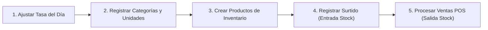

# 📖 Guía Completa de Uso y Operación — mi_bodega

Este documento sirve como manual paso a paso para usuarios finales y miembros del equipo de desarrollo de **mi_bodega**.

---

## 🚀 1. Puesta en Marcha Inicial

### Paso 1: Configurar Base de Datos
Importa el script SQL `/database/mi_bodega_mvp.sql` en tu servidor MySQL (ej. PHPMyAdmin o cliente MySQL CLI):
```bash
mysql -u root -p mi_bodega_db < database/mi_bodega_mvp.sql
```

### Paso 2: Compilar Estilos CSS (Tailwind CSS v4)
El proyecto utiliza **Tailwind CSS v4** para la interfaz. Para compilar los estilos:
```bash
npm run build:css
```
Para observar cambios en vivo durante el desarrollo:
```bash
npm run watch:css
```

> 💡 **Nota**: `node_modules` debe existir en la raíz. Si no existe, ejecuta `npm install` una sola vez. La carpeta está en `.gitignore` y no pesa en el repositorio.

### Paso 3: Iniciar Servidor Local
Desde la raíz del repositorio, ejecuta obligatoriamente con `server.php` como router:
```bash
php -S localhost:3000 server.php
```

> ⚠️ **Importante**: No ejecutes `php -S localhost:3000` sin `server.php`. El servidor built-in de PHP no procesa archivos `.htaccess`, por lo que sin el router las peticiones a archivos estáticos (CSS, JS, fuentes) devolverán 404.

### Paso 4: Iniciar Sesión
Abre tu navegador e ingresa a: `http://localhost:3000/mi_bodega/`

**Credenciales Iniciales de Administrador**:
* **Usuario**: `admin`
* **Contraseña**: `admin123`

> 💡 **Tip de Operación**: En la pantalla de login puedes hacer clic sobre el recuadro informativo de credenciales predeterminadas para autorellenar el usuario y clave en 1 solo clic. También dispones del botón con icono de ojo para alternar la visibilidad de la contraseña. Al ingresar, serás redirigido directamente al **Punto de Venta (POS)**.

---

## 🛒 2. Flujo Operativo del Sistema



### 💱 1. Actualizar Tasa de Cambio (`/tasa-moneda`)
* Accede al menú **Tasa Moneda** desde el sidebar.
* Ingresa los valores correspondientes al día (**Tasa USD**, **Tasa Euro**, **Tasa Paralelo**).
* Al registrar la nueva tasa, los precios en moneda local (Bolívares) de todos los productos se actualizarán dinámicamente en la interfaz.

### 📦 2. Configurar Categorías y Unidades (`/categorias` & `/unidades`)
* Define las familias de productos (ej. *Charcutería*, *Viveres*, *Bebidas*).
* Configura las unidades de medida (ej. *Kg*, *Gramos*, *Litros*, *Unidades*).

### 🏷️ 3. Gestionar Inventario y Precios (`/productos`)

#### Crear un Nuevo Producto
1. Haz clic en **+ Nuevo producto**.
2. Completa el nombre, peso, unidad, categoría y stock inicial.
3. Ingresa el **Precio de Costo Neto** ($ USD), el **Porcentaje de Ganancia** (mínimo 30%) y el **IVA** (16%).
4. El sistema calcula automáticamente en tiempo real:
   - **Precio de Venta Final** = `Costo × (1 + Ganancia/100) × (1 + IVA/100)`
   - **Equivalente en Bolívares** = `Precio USD × Tasa BCV del día`

#### Eliminación Masiva de Productos
1. Selecciona uno o varios productos mediante las **casillas de verificación** (checkboxes) en la tabla del catálogo.
2. Aparecerá una barra de acciones masivas mostrando el conteo de seleccionados.
3. Presiona el botón **Eliminar seleccionados (N)**.
4. Confirma la acción en el modal de confirmación desplegado.

#### Ajuste Masivo de Precios (Estilo Mercado Libre)
1. Selecciona los productos que deseas modificar desde la tabla.
2. Presiona **Ajustar precios (N)** para abrir el modal interactivo.
3. Configura el ajuste:
   - **Campo a modificar**: *Precio de Costo Neto* (recalcula venta automáticamente) o *Precio de Venta Final* (ajuste directo).
   - **Operación**: *Aumentar (+)* o *Disminuir (-)*.
   - **Modalidad**: *Porcentaje (%)* o *Monto Fijo ($ USD)*.
   - **Valor**: El número a aplicar (ej. `10` para 10% o `0.50` para $0.50 USD).
4. Una **previsualización dinámica** explicará exactamente la operación antes de aplicar.
5. Haz clic en **Aplicar ajuste** para ejecutar los cambios en lote.

> 💡 **Ejemplo**: Si seleccionas 5 productos, eliges *Precio de Costo Neto*, *Aumentar*, *Porcentaje*, `15` → El sistema aumentará un 15% el costo neto de los 5 productos y recalculará automáticamente el precio de venta final de cada uno respetando su margen de ganancia e IVA individual.

### 🚚 4. Registrar Surtidos de Mercancía (`/surtidos/crear`)
* Selecciona el proveedor del catálogo.
* Utiliza el formulario multirrenglón para agregar múltiples productos recibidos, especificando la cantidad entera y el precio costo unitario.
* Al presionar **Registrar Surtido**, una **transacción atómica** incrementará automáticamente el stock de cada producto involucrado.

### 💳 5. Operar el Punto de Venta POS (`/pos`)
* Selecciona los productos del catálogo mediante la barra de búsqueda rápida.
* Ajusta las cantidades deseadas en el carrito.
* Selecciona o asigna el cliente (o *Consumidor Final*).
* Elige el método de pago (*Efectivo*, *Transferencia*, *Pago Móvil*, *Biopago*, *Cashea*).
* Para *Transferencia* y *Pago Móvil*, el sistema solicitará un **número de referencia**.
* Haz clic en **Procesar Venta**. La transacción descontará el stock y registrará el comprobante.

---

## 👤 3. Administración de Usuarios y Roles (`/usuarios`)

### Crear Cuentas para Personal
1. Ingresa a la sección **Usuarios** (Requiere Rol Administrador).
2. Haz clic en **Nuevo Usuario**.
3. Asigna un **Nombre de usuario**, **Nombre completo**, **Contraseña** y selecciona el **Rol**:
   - **Administrador**: Acceso total a todos los módulos, incluyendo gestión de usuarios, ajustes del sistema y operaciones masivas.
   - **Vendedor**: Acceso restringido al Punto de Venta (POS), clientes, productos y lectura de inventario.

### Gestión de Estado de Usuarios
* El administrador puede **activar o desactivar** cuentas de usuario.
* Los usuarios con estado **inactivo** serán rechazados automáticamente por el sistema de login, impidiendo su acceso.

---

## 🛠️ 4. Solución de Problemas Frecuentes

### ¿Qué hacer si aparece Error 403 Forbidden?
* Ocurre cuando un usuario con rol *Vendedor* intenta acceder a rutas administrativas como `/usuarios`. Debes iniciar sesión con una cuenta de rol *Administrador*.

### ¿Qué hacer si aparece la pantalla de Cuenta Bloqueada?
* El sistema bloquea temporalmente por 5 minutos la cuenta/sesión tras 5 intentos fallidos de clave. Espera 5 minutos o limpia las cookies de tu navegador.

### ¿Los estilos no cargan (página sin formato)?
* Asegúrate de iniciar el servidor con `php -S localhost:3000 server.php` (no sin `server.php`).
* Si modificaste clases de Tailwind, ejecuta `npm run build:css` para recompilar los estilos.

### ¿Cómo resetear la contraseña del Administrador?
* Puedes ejecutar la siguiente sentencia SQL directamente en MySQL para resetear la clave de `admin` a `admin123`:
```sql
UPDATE usuarios 
SET usuario_password = '$2y$10$eA0qE6l9n... (Hash Bcrypt de admin123)' 
WHERE usuario_nombre = 'admin';
```
