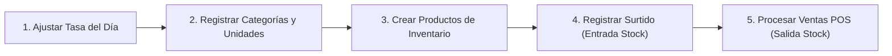

# 📖 Guía Completa de Uso y Operación — mi_bodega

Este documento sirve como manual paso a paso para usuarios finales y miembros del equipo de desarrollo de **mi_bodega**.

---

## 🚀 1. Puesta en Marcha Inicial

### Paso 1: Configurar Base de Datos
Importa el script SQL `/database/mi_bodega_mvp.sql` en tu servidor MySQL (ej. PHPMyAdmin o cliente MySQLCLI):
```bash
mysql -u root -p mi_bodega_db < database/mi_bodega_mvp.sql
```

### Paso 2: Iniciar Servidor Local
Desde la raíz del repositorio, ejecuta:
```bash
php -S localhost:8000
```

### Paso 3: Iniciar Sesión
Abre tu navegador e ingresa a: `http://localhost:8000/mi_bodega/`

**Credenciales Iniciales de Administrador**:
* **Usuario**: `admin`
* **Contraseña**: `admin123`

> 💡 **Tip de Operación**: En la pantalla de login puedes hacer clic sobre el recuadro informativo de credenciales predeterminadas para autorellenar el usuario y clave en 1 solo clic. También dispones del botón con icono de ojo para alternar la visibilidad de la contraseña. Al ingresar, serás redirigido directamente al **Punto de Venta (POS)**.

---

## 🛒 2. Flujo Operativo del Sistema



### 💱 1. Actualizar Tasa de Cambio (`/tasa-moneda`)
* Accede al menú **Tasa Moneda**.
* Ingresa los valores correspondientes al día (**Tasa USD**, **Tasa Euro**, **Tasa Paralelo**).
* Al registrar la nueva tasa, los precios en moneda local (Bolívares) de todos los productos y ventas se actualizarán o calcularán automáticamente.

### 📦 2. Configurar Categorías y Unidades (`/categorias` & `/unidades`)
* Define las familias de productos (ej. *Charcutería*, *Viveres*, *Bebidas*).
* Configura las unidades de medida (ej. *Kg*, *Gramos*, *Litros*, *Unidades*).

### 🏷️ 3. Gestionar Inventario (`/productos`)
* Haz clic en **Nuevo Producto**.
* Completa el nombre (ej. *Queso Paisa*), peso (ej. *1*), unidad (ej. *Kg*), precio de compra, precio de venta y stock inicial.
* El sistema generará automáticamente la denominación combinada (ej. *Queso Paisa 1 Kg*).

### 🚚 4. Registrar Surtidos de Mercancía (`/surtidos/crear`)
* Selecciona el proveedor del catálogo.
* Utiliza el formulario multirrenglón para agregar múltiples productos recibidos, especificando la cantidad entera y el precio costo unitario.
* Al presionar **Registrar Surtido**, una **transacción atómica** incrementará automáticamente el stock de cada producto involucrado.

### 💳 5. Operar el Punto de Venta POS (`/pos`)
* Selecciona los productos del catálogo mediante la barra de búsqueda rápida.
* Ajusta las cantidades deseadas.
* Selecciona o asigna el cliente (o *Consumidor Final*).
* Elige el método de pago (*Efectivo*, *Transferencia*, *Pago Móvil*, *Biopago*, *Cashea*).
* Haz clic en **Procesar Venta**. La transacción descontará el stock e imprimirá/generará el comprobante de venta.

---

## 👤 3. Administración de Usuarios y Roles (`/usuarios`)

### Crear Cuentas para Personal
1. Ingresa a la sección **Usuarios** (Requiere Rol Administrador).
2. Haz clic en **Nuevo Usuario**.
3. Asigna un **Nombre de usuario**, **Nombre completo**, **Contraseña** y selecciona el **Rol**:
   - **Administrador**: Acceso total a todos los módulos, incluyendo gestión de usuarios y ajustes del sistema.
   - **Vendedor**: Acceso restringido al Punto de Venta (POS), clientes, productos y lectura de inventario.

---

## 🛠️ 4. Solución de Problemas Frecuentes

### ¿Qué hacer si aparece Error 403 Forbidden?
* Ocurre cuando un usuario con rol *Vendedor* intenta acceder a rutas administrativas como `/usuarios`. Debes iniciar sesión con una cuenta de rol *Administrador*.

### ¿Qué hacer si aparece la pantalla de Cuenta Bloqueada?
* El sistema bloquea temporalmente por 5 minutos la cuenta/sesión tras 5 intentos fallidos de clave. Espera 5 minutos o limpia las cookies de tu navegador.

### ¿Cómo resetear la contraseña del Administrador?
* Puedes ejecutar la siguiente sentencia SQL directamente en MySQL para resetear la clave de `admin` a `admin123`:
```sql
UPDATE usuarios 
SET usuario_password = '$2y$10$eA0qE6l9n... (Hash Bcrypt de admin123)' 
WHERE usuario_nombre = 'admin';
```
